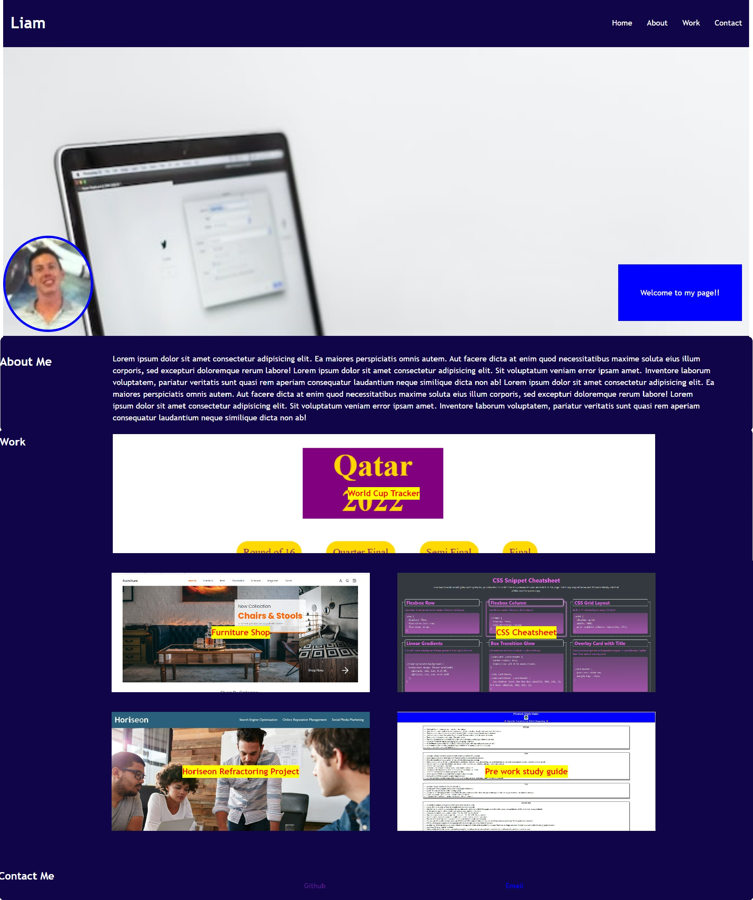

# Liam's-portfolio

_My Porfolio Site_

Horiseon-website
Improving a website's accessibilty for a fictional company 'Horiseon'

## Description

- This repo contains my portfolio website. It showcases my most recent work and will be updated, as I progress throughout the course.
- It contains my name, a picture, and links to contact me in the footer, including email.
- It is repsonsive, and uses smooth scrolling when links are clicked in the nav.

## Usage

For a link to my recent work, click on the project in th ework section.
To contact me, see the footer links

## Screenshot

## The website

This site can be found at https://liamjameswatson.github.io/liam-portfolio/

## License

MIT License (Please refer to LICENSE in the repo.)
